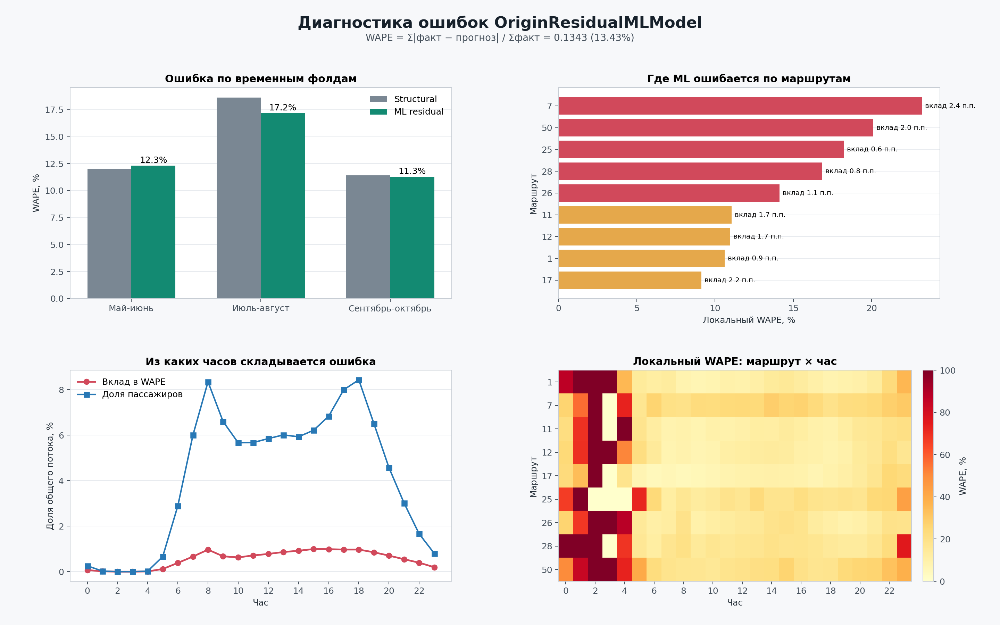

# Прогноз пассажиропотока трамваев

Проект прогнозирует почасовое число посадок на трамвайных маршрутах. Итоговый
прогноз строится для ноября-декабря 2025 года. Сохранённую модель можно запускать
для другого горизонта в пределах 2025 года, если файл погоды покрывает все его
даты и подготовлен календарь плановых изменений движения.

## Подход

Решение состоит из двух уровней.

1. **Структурная модель** оценивает ожидаемый суточный пассажиропоток и
   распределяет его по 24 часам. Она использует медианные уровни по дням недели,
   почасовые профили, больший вес недавних наблюдений, краткосрочный тренд,
   праздники, рабочие субботы, месячную сезонность и погоду.
2. **ML-коррекция** обучает `ExtraTreesRegressor` предсказывать остаток
   структурной модели по календарным, погодным и маршрутным признакам, горизонту,
   недавнему состоянию ряда и заранее известным изменениям движения. Для
   обучения выбираются последовательные исторические точки запуска прогноза.
   В каждой такой точке модель получает только более ранние наблюдения, строит
   прогноз на следующий период и сравнивает его с уже известным историческим
   фактом. Это предотвращает утечку будущих данных.

## Окружение

Рекомендуется Python 3.11 или 3.12.

Откройте Anaconda Prompt или PowerShell в корне репозитория и выполните:

```powershell
conda create -n tram python=3.11 -y
conda activate tram
python -m pip install --upgrade pip
python -m pip install -r requirements.txt
```

Проверка окружения:

```powershell
python --version
python -c "import numpy, pandas, sklearn, joblib, matplotlib; print('OK')"
```

## Структура проекта

```text
project/
|-- dataset/
|   |-- labels/
|   |   |-- labels_day_train.csv
|   |   `-- labels_day_test.csv
|   |-- test_submission.csv
|   `-- tram_service_changes_2025.csv
|-- 62521CSV/
|   `-- data-62521-15-09-2026.csv
|-- subm/
|   |-- tram_ml_forecast_model.joblib
|   |-- READY_TO_UPLOAD_UNIFIED_ML.csv
|   |-- READY_TO_UPLOAD_DECOMPOSED_ML.csv
|   |-- ui_forecasts.csv
|   `-- ml_error_*.csv
|-- open-meteo-55.78N37.58E151m.csv
|-- core_model.py
|-- project_data.py
|-- tram_forecast_model.py
|-- tram_ml_forecast_model.py
|-- service_change_features.py
|-- model_persistence.py
|-- run_inference.py
|-- export_ui_forecasts.py
|-- submission_utils.py
`-- visualize_ml_errors.py
```

## Источники данных

Файлы `dataset/labels/labels_day_train.csv`,
`dataset/labels/labels_day_test.csv` и `dataset/test_submission.csv` входят в
исходный набор соревнования. Они содержат целевую переменную и шаблон ответа и
не относятся к дополнительно собранным данным.

В решении используются следующие внешние источники:

- **Производственный календарь:** в `project_data.py` заданы праздничные
  интервалы и рабочая суббота 1 ноября 2025 года.
- **Погода:** [Open-Meteo Historical Weather API](https://open-meteo.com/en/docs/historical-weather-api).
  Файл `open-meteo-55.78N37.58E151m.csv` выгружен для координат
  `55.782074, 37.576374`, часового пояса `Europe/Moscow` и периода
  `2025-01-01` --- `2025-12-31`. Для реального будущего горизонта данные той же
  структуры нужно получать из [Open-Meteo Forecast API](https://open-meteo.com/en/docs).
- **Месячная сезонность:** набор №62521
  [«Месячный пассажиропоток по всем видам общественного транспорта в городе Москве»](https://data.mos.ru/opendata/62521)
  на Портале открытых данных Правительства Москвы. Локальная выгрузка хранится
  в `62521CSV/data-62521-15-09-2026.csv`.
- **Плановые изменения движения:** официальные публикации Московского
  транспорта. Ссылка на первоисточник каждого события сохранена в колонке
  `source_url` файла `dataset/tram_service_changes_2025.csv`.

Использованные публикации об изменениях движения:

- [transport.mos.ru, публикация 123857](https://transport.mos.ru/mostrans/all_news/123857);
- [transport.mos.ru, публикация 124110](https://transport.mos.ru/mostrans/all_news/124110);
- [transport.mos.ru, публикация 125272](https://transport.mos.ru/mostrans/all_news/125272);
- [transport.mos.ru, публикация 125846](https://transport.mos.ru/mostrans/all_news/125846);
- [канал «Дептранс. Оперативно», публикация 22627](https://t.me/s/DtOperativno/22627);
- [transport.mos.ru, публикация 125448](https://transport.mos.ru/mostrans/all_news/125448);
- [transport.mos.ru, публикация 126461](https://transport.mos.ru/mostrans/all_news/126461);
- [transport.mos.ru, публикация 126306](https://transport.mos.ru/mostrans/all_news/126306);
- [transport.mos.ru, публикация 126945](https://transport.mos.ru/mostrans/all_news/126945);
- [transport.mos.ru, публикация 127065](https://transport.mos.ru/mostrans/all_news/127065);
- [transport.mos.ru, публикация 127620](https://transport.mos.ru/mostrans/all_news/127620).

Значения `status`, `severity` и интервалы действия в календаре изменений --- это
подготовленные для модели признаки на основе содержания указанных публикаций,
а не готовые поля исходных страниц.

## Структура данных

Все даты записываются в формате `YYYY-MM-DD`. Проектные CSV используют
кодировку UTF-8 и разделитель `;`, кроме файла Open-Meteo, где используется
разделитель `,`.

### История пассажиропотока

Файлы `dataset/labels/labels_day_train.csv` и
`dataset/labels/labels_day_test.csv` имеют одинаковую схему:

| Колонка | Тип | Значение |
|---|---:|---|
| `route` | int | Номер маршрута |
| `date` | date | Дата наблюдения |
| `hour` | int | Час от 0 до 23 |
| `boardings` | float | Неотрицательное число посадок |

Пример:

```csv
route;date;hour;boardings
1;2025-01-01;5;2
1;2025-01-01;6;26
```

Пара `(route, date, hour)` должна быть уникальной. Пропущенный час внутри
существующего маршрутодня считается нулевым. Полностью отсутствующий
маршрутодень считается неизвестным и не превращается в набор нулей. При
обучении оба файла объединяются; пересекающихся ключей в них быть не должно.

### Погода

`open-meteo-55.78N37.58E151m.csv` должен быть часовым CSV, выгруженным из
Open-Meteo. Первая строка содержит метаданные:

```csv
latitude,longitude,elevation,utc_offset_seconds,timezone,timezone_abbreviation
55.782074,37.576374,151.0,10800,Europe/Moscow,GMT+3
```

После пустой строки следует таблица погоды. Код использует колонки:

- `time` --- локальная дата и время;
- колонку, имя которой начинается с `temperature_2m`;
- `rain (mm)`;
- `snowfall (cm)`;
- `wind_speed_10m (km/h)`.

На каждый календарный день должны присутствовать ровно 24 уникальные строки без
пропусков и нечисловых значений. Обязательны часовой пояс `Europe/Moscow` и
смещение `10800`. Для инференса файл должен покрывать весь выбранный горизонт;
будущие значения можно заменить прогнозом погоды в той же схеме.

### Плановые изменения маршрутов

`dataset/tram_service_changes_2025.csv` описывает события, известные до даты
прогноза:

| Колонка | Допустимое значение |
|---|---|
| `event_id` | Уникальный идентификатор события |
| `route` | Номер маршрута |
| `start_date`, `end_date` | Включительные границы события |
| `day_filter` | `all`, `weekday` или `weekend` |
| `start_hour`, `end_hour` | Включительные границы от 0 до 23 |
| `status` | `suspended`, `shortened`, `rerouted` или `late_night` |
| `severity` | Число от 0 до 1 |
| `source_url` | Ссылка на источник, моделью не используется |
| `note` | Комментарий, моделью не используется |

Из событий рассчитываются доля затронутых часов, тип изменения и средняя и
максимальная серьёзность. При пересечении событий для часа берётся максимальная
серьёзность.

### Месячная сезонность

`62521CSV/data-62521-15-09-2026.csv` содержит официальную помесячную статистику:

| Колонка | Значение |
|---|---|
| `Year` | Год |
| `Month` | Название месяца на русском языке |
| `Type of transport` | Вид транспорта; используются строки `Трамвай` |
| `Passenger traffic` | Положительный месячный пассажиропоток |

Для каждого года из набора `2019, 2022, 2023, 2024` должны присутствовать все
12 месяцев. Остальные колонки игнорируются. На основе файла строится
нормированный месячный индекс сезонности.

### Шаблон submission

`dataset/test_submission.csv` содержит колонки:

```csv
route;date;hour;prediction
```

Код проверяет, что шаблон содержит полную ожидаемую сетку маршрутов, дат и
часов. Маршрут 5 отсутствует в обучающих метках, поэтому для него сохраняются
значения из шаблона.

## Обучение

```powershell
python tram_ml_forecast_model.py
```

Команда обучает финальную модель на всей доступной истории и создаёт:

- `subm/tram_ml_forecast_model.joblib`;
- `subm/READY_TO_UPLOAD_UNIFIED_ML.csv`;
- `subm/unified_ml_report.json`.

## Инференс

Пример прогноза для двух маршрутов и двух дней:

```powershell
python run_inference.py `
  --model subm/tram_ml_forecast_model.joblib `
  --weather open-meteo-55.78N37.58E151m.csv `
  --service-changes dataset/tram_service_changes_2025.csv `
  --start 2025-11-01 `
  --end 2025-11-02 `
  --routes 1,7 `
  --output subm/inference_test.csv
```

Если параметр `--routes` не указан, используются все маршруты обученной модели.

## Анализ ошибок

```powershell
python visualize_ml_errors.py
```

Команда пересчитывает ошибки модели и создаёт график
`subm/ml_error_analysis.png`, а также таблицы ошибок по маршрутам, часам,
периодам и типам изменений движения.



## Быстрая проверка инференса

```powershell
python run_inference.py --model subm/tram_ml_forecast_model.joblib --weather open-meteo-55.78N37.58E151m.csv --service-changes dataset/tram_service_changes_2025.csv --start 2025-11-01 --end 2025-11-02 --routes 1,7 --output subm/inference_test.csv
```

## Статический UI: корректирующие коэффициенты

На сайт не нужно загружать модель или запускать Python-инференс. Один раз
сформируйте таблицу с готовым прогнозом и его разложением:

```powershell
python export_ui_forecasts.py
```

Команда также создаёт конкурсный файл
`subm/READY_TO_UPLOAD_DECOMPOSED_ML.csv`. Он содержит стандартные четыре
колонки и совпадает с итоговым прогнозом при значениях всех ползунков `100%`.

На сайт загружается только `subm/ui_forecasts.csv`. Помимо ключей `route`,
`date`, `hour`, таблица содержит нейтральный прогноз `base_prediction`, штатный
`prediction` и три положительных множителя:

- `season_coefficient` -- влияние месячной сезонности;
- `weather_coefficient` -- влияние прогноза погоды;
- `event_coefficient` -- влияние заранее известных изменений движения.

Для каждого ползунка используется сила от `0` до `2`: `0` отключает поправку,
`1` соответствует обученной модели, `2` усиливает её вдвое в логарифмической
шкале. При значениях $s=w=e=1$ формула точно воспроизводит штатный прогноз:

$$prediction = base \cdot season^s \cdot weather^w \cdot event^e.$$

Пример расчёта в JavaScript:

```javascript
const seasonStrength = Number(seasonSlider.value) / 100;
const weatherStrength = Number(weatherSlider.value) / 100;
const eventStrength = Number(eventSlider.value) / 100;

const prediction = Math.round(
  Number(row.base_prediction) *
  Math.pow(Number(row.season_coefficient), seasonStrength) *
  Math.pow(Number(row.weather_coefficient), weatherStrength) *
  Math.pow(Number(row.event_coefficient), eventStrength)
);
```

Коэффициенты формируются воспроизводимо из четырёх сценариев одной сохранённой
модели: все поправки выключены; включён сезон; включены сезон и погода; включены
сезон, погода и события. Поэтому их последовательное произведение возвращает
исходный прогноз, включая ML-реакцию на соответствующие признаки.

## Агрегация и приём данных

`core_model.load_history()` читает обе таблицы целевой переменной, приводит
`route`, `date`, `hour` и `boardings` к заданным типам и отклоняет дубликаты,
отрицательные и нечисловые значения. `core_model.daily_vectors()` агрегирует
почасовые наблюдения в 24-мерный вектор для каждой пары «маршрут---дата»;
пропущенный час внутри известного дня трактуется как нулевой поток.

Загрузчики `project_data.load_weather()` и
`service_change_features.load_service_changes()` проверяют временную зону,
полноту 24 часов, даты, диапазоны часов, типы событий и их тяжесть. Команда
`python export_ui_forecasts.py` заново проходит тот же пайплайн, загружает
сохраненную модель и детерминированно создаёт UI-таблицу. Таким образом,
агрегация целевой величины и приём внешних CSV воспроизводятся из исходных
файлов одной командой.
